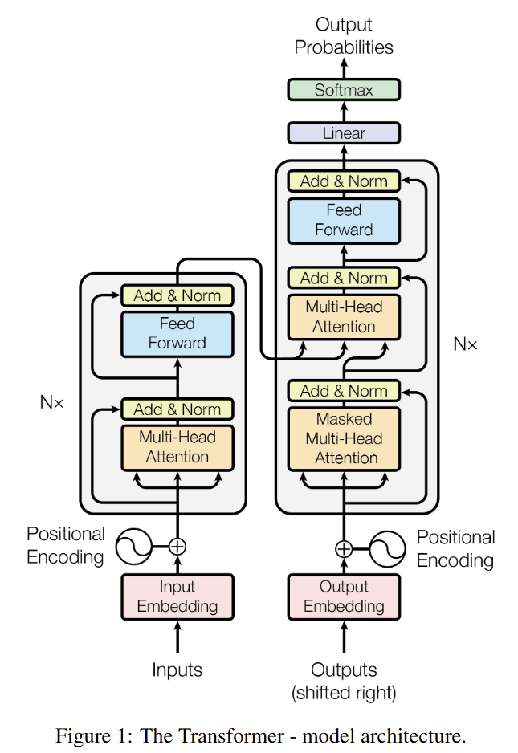

At the time I write this blog, everyone is crazy about Large Language Models (LLMs), which have been built on Transformers architecture introduced in the paper [Attention is all you need](https://arxiv.org/abs/1706.03762) by Vaswani et al. in 2017.

Also, I have extensively use BERT model during my PhD to develop information extractors, which also is built on Transformers architecture. However, I didn't have chance to intuitively 

---

# 1. Definition:

- An **advanced** deep learning architecture to **process sequential data** (e.g., text)
- Introduced in the paper “Attention is all you need” by Vaswani et al. (NeurIPS’17)
- Unlike RNN/LSTM, Transformer enables **processing sequential data in parallel** based solely on **attention mechanisms**
- Transformer architecture **overcomes the challenges of RNN/LSTM**:
    - First, ***vanishing and exploding gradients*** in RNN
        - Gradients have to pass through multiple layers as the RNN processes data sequentially.
        - [LSTM](https://www.bioinf.jku.at/publications/older/2604.pdf) and [GRU](https://arxiv.org/pdf/1406.1078) can’t fully address this problem in RNN.
    - Second, RNN-based architectures have a ***slow training process***
    - Third, RNNs and LSTMs ***struggle with long-range dependencies***
        - Those models start to forget when processing long distances ([Zhao et al., 2020](https://proceedings.mlr.press/v119/zhao20c))

---

# 2. Model Architecture:

## 2.1. Overall structure

<aside>
💡

Transformer is an **encoder-decoder architecture** model.

</aside>

---

### 2.1.1. Encoder:

- A stack of $N=6$ identical transformer blocks/layers
- Each block/layer has **2 sub-blocks**:
    - The 1st sub-block is a multi-head attention self-attention mechanism.
    - The 2nd sub-block is a simple, position-wise fully connected feed-forward network.
    - [Residual connection](https://openaccess.thecvf.com/content_cvpr_2016/html/He_Deep_Residual_Learning_CVPR_2016_paper.html) is employed around each of the two sub-layers.
    - Follow residual connection, [layer normalisation](https://arxiv.org/abs/1607.06450) is employed.

### 2.1.2. Decoder:

- A stack of $N=6$ identical transformer blocks/layers as the encoder
- Unlike the encoder, the **decoder has a 3rd sub-layer**:
    - A multi-head attention over the output of the encoder stack
- Self-attention sub-layers are modified to prevent positions from attending to subsequent positions. This is called **Masked Self-attention**.
- Output embeddings are offset by one position.

---

## 2.2. Transformers Block [[1](https://arxiv.org/abs/2304.10557)]

The transformer block comprises **two stages**:

1. **Stage 1: Self-attention across the sequence**
    - *Purpose:*
        - Refine features independently based on the tokens’ relationship in the sequence.
        - Specifically, how much the $n^{th}$ word depends on the ${m}^{th}$ word in the sequence.
        - Act horizontally across rows of the input matrix $X^{(m-1)}$. (see [2.2.1](Transformer%20Architecture%20-%20Math%20&%20Intuition%2025d657c90a9280db94afe987fe02f605.md))
    
2. **Stage 2: Multi-layer perception across features**
    - *Purpose:*
        - Refine features representing each token.
        - Act vertically across columns of the input matrix $X^{(m-1)}$. (see [2.2.1](Transformer%20Architecture%20-%20Math%20&%20Intuition%2025d657c90a9280db94afe987fe02f605.md))

---

### 2.2.1. Input Data Format

- Data (e.g., text words of image batches) of the transformer block is converted into a sequence of $N$ tokens $\boldsymbol{x}_n^{(0)}$ of dimension $D$.
- Usually, the input is organised into a matrix $D\times N$.

Figure 1 illustrates the input format:

Figure 1: The input to a transformer is $N$ vectors $x^{(0)}_n$ , which are each $D$ dimensional. These can be collected together into an array $X^{(0)}$.

### 2.2.2. Stage 1: Self-attention across the sequence

**INPUT:**

- The $D \times N$ matrix from Section 2.2.1, obtained by embedding methods (fixed or learnable).

**OUTPUT:**

- Another $D\times N$ matrix with information being aggregated across sequence independently for each feature using an attention mechanism.

---

**2.2.2.1. Attention.**

(See [Attention Mechanisms](https://www.notion.so/Attention-Mechanisms-Overview-263657c90a9280e9bc6ae8dfb09d23e1?pvs=21) for different types of attention)

<aside>
💡

A machine learning **technique** that directs deep learning models to **prioritise (or attend to) the most relevant parts of input data.**

</aside>

Technically, the output vector at location $n$ is a weighted average of input features at location $n'=1,2,...,N$:

$$
\boldsymbol{y}_n^{(m)}=\sum_{n'=1}^N \boldsymbol{x}_{n'}^{(m-1)} \cdot \boldsymbol{A}_{n', n}^{(m)}
$$

where:

- $\boldsymbol{y}_n^{(m)}$ is the output vector at location $n$
- $\boldsymbol{x}_{n'}^{(m-1)}$ is the input feature at location $n'$
- $\boldsymbol{A}_{n', n}^{(m)}$ is a so-called attention matrix
    - Size of $N \times N$
    - Normalises over its columns: $\sum_{n'=1}^N \boldsymbol{A}_{n', n}^{(m)} = 1$.

If the feature at the location $n'$ is highly relevant to that at location $n$, then $\boldsymbol{A}_{n', n}^{(m)}$ has a high value.

The attention is visualised in Figure 2.

Figure 2: Attention.

---

**2.2.2.2. Self-attention**

In transformer architecture, the attention matrix $\boldsymbol{A}^{(m)}$ is generated from the input sequence itself — so-called *self-attention*.

---

**A. Naive Approach.**

- Generating the attention matrix by measuring the similarity between two locations by the dot product between the features at those two locations.
- Using softmax to normalise to 1

$$
A_{n,n'} = \frac{\exp( \bm{x}_n^\top  \bm{x}_{n'})}{\sum_{n''=1}^N \exp(\bm{x}_{n''}^\top \bm{x}_{n'})}.
$$

- **Limitation:**
    - **Entangle information about the similarity between locations in the sequence with the content of the sequence** itself  [[Turner](https://arxiv.org/pdf/2304.10557)]

---

**B. Symmetric Linear Approach.**

- Perform the same operation on a linear transformation of the sequence, i.e. $U \bm{x}_n$.
    
    $$
    A_{n,n'} = \frac{\exp( \bm{x}_n^\top U^\top U \bm{x}_{n'})}{\sum_{n''=1}^N \exp(\bm{x}_{n''}^\top U^\top U \bm{x}_{n'})}
    $$
    
    - $U$ will project to a lower dimensional space $K$ where $K < D$.
    - By doing this, some irrelevant features are projected out ⇒ decoupling the attention computation from the content.
- **Limitation:**
    - The numerator is symmetric:
        - E.g., we might want the word ‘caulking iron’ to be strongly associated with the word
        ‘tool’ (as it is a type of tool), but have the word ‘tool’ more weakly associated
        with the word ‘caulking iron’ (because most of us rarely encounter it). [[Turner](https://arxiv.org/pdf/2304.10557)]

---

**C. Assymmetric Linear Approach.**

- Apply two different linear transformations to the original sequences to address the limitations of approach B
    
    $$
    A_{n,n'} = \frac{\exp \left( \bm{x}_n^\top U_{\bm{k}}^\top U_{\bm{q}}^{} \bm{x}_{n'} \right)}{\sum_{n''=1}^N \exp \left(\bm{x}_{n''}^\top U_{\bm{k}}^\top U_{\bm{q}}^{} \bm{x}_{n'}\right)}.
    $$
    
    where:
    
    - $\bm{q}_n = U_{\bm{q}}\bm{x}_{n}$ and $\bm{k}_n = U_{\bm{k}} \bm{x}_{n}$ are typically known as *queries* and *keys,* respectively.
    

---

**2.2.2.3. Multi-head Self-attention (MHSA)**

**Motivation:**

- It would be useful for pairs of points to be similar in some ‘dimensions’ and different in others.

**Definition:**

- Transformer block applies $H$ sets of self-attention in parallel (or we call $H$ heads).
- Linearly project the results down to the $D \times N$ array.

**Formula:**

$$
Y^{(m)} = \text{MHSA}_{\theta}(X^{(m-1)}) = \sum_{h=1}^H V^{(m)}_h X^{(m-1)} A_h^{(m)}
$$

where:

$$
[A^{(m)}_{h}]_{n,n'} = \frac{\exp\left( \left(\bm{k}_{h,n}^{(m)}\right)^\top  \bm{q}_{h,n'}^{(m)} \right)}{\sum_{n''=1}^N \exp \left( \left(\bm{k}_{h,n''}^{(m)}\right)^\top   \bm{q}_{h,n'}^{(m)} \right)} \\ \bm{q}_{h,n}^{(m)} = U^{(m)}_{\bm{q},h} \bm{x}^{(m-1)}_{n} \;\; \text{and} \;\;\bm{k}_{h,n}^{(m)} = U^{(m)}_{\bm{k},h} \bm{x}^{(m-1)}_{n}.
$$

**Schematic visualisation of Self-attention:**

Figure 3: Multi-head self-attention applies $H$ self-attention operations in parallel and then linearly projects the $HD \times N$ dimensional output down to $D \times N$ by applying a linear transform, implemented here by the $H$ matrices $V_h$. 

---

### 2.2.3. Stage 2: Multi-layer Perceptron across features

**Motivation:**

- From the [formula of the MHSA](Transformer%20Architecture%20-%20Math%20&%20Intuition%2025d657c90a9280db94afe987fe02f605.md), the addition of the matrices $V^{(m)}_h$ and retaining the diagonal elements of the attention matrix $A^{(m)}$ somehow does cross-feature processing.
- However, this processing is limited.

⇒ This stage 2 comes in place.

**Formula:**

- Apply a multi-layer perceptron (MLP) to the vector of features at each location $n$ in the sequence:
    
    $$
    \bm{x}_n^{(m)} = \text{MLP}_{\theta}(\bm{y}_n^{(m)}).
    $$
    
    Here, $\theta$ is the same for each location $n$.
    

---

**Transformers are Graph Neural Networks:**

- This part can answer the following questions:
    - Why can the performance of transformers be comparable with GNNs in the Relation Extraction task?
- GNNs, at a high level, perform 2 steps:
    - First, message passing from neighbour nodes.
    - Second, aggregating information to update the target node.
- Through this lens, relating to the Transformers architecture:
    - The Transformer is a fully-connected GNN where tokens are nodes.
    - MHSA can be formed as a message-passing step. In particular, MHSA can be related to the Graph Attention Networks.
    - MLPs can be formed as a feature update step.
    - Each transformer block is one update of the GNN.
    - To scale the transformer architecture, proposed sparse forms of attention further introduces different graphs.

---

### 2.2.4. Residual Connection & Layer Normalisation

**2.2.4.1. Residual Connection**

**Design structure:**

- In the transformer block, the Residual Connection is parameterised in terms of an identity mapping and a residual term:
    
    $$
    x^{(m)} = x^{(m-1)} + \text{res}_{\theta}(x^{(m-1)}).
    $$
    
    Equivalently, this can be rewritten:
    
    $$
    x^{(m)} - x^{(m-1)} = \text{res}_{\theta}(x^{(m-1)})
    $$
    

**Intuition:**

- This can be viewed as modelling the differences between representations.
- And work well when the function that is being modelled is close to identity.
- The residual connection is applied for both MHSA and MLP
⇒ Apply a mild non-linear transformation to the representation.
⇒ These mild transformations will be amplified over many layers.

---

**2.2.4.1. Token normalisation**

**Motivation:**

- To stabilise the learning process of the Transformer architecture.
- This transform stops feature representations from blowing up in magnitude.

**Design structure:**

- Using [LayerNorm](https://arxiv.org/abs/1607.06450) to normalise each token separately
    
    $$
    \bar{x}_{d,n}  = \frac{1}{\sqrt{\text{var}(\bm{x}_n)}} \left( x_{d,n} - \text{mean}(\bm{x}_n) \right) \gamma_d + \beta_d = \text{LayerNorm}(X)_{d,n}
    $$
    
    where $\text{mean}(\bm{x}_n) = \frac{1}{D} \sum_{d=1}^D x_{d,n}$ and $\text{var}(\bm{x}_n) = \frac{1}{D} \sum_{d=1}^D (x_{d,n} - \text{mean}(\bm{x}_n))^2$. The two parameters $\gamma_d$ and $\beta_d$ are a learned scale and shift.
    

**Schematic visualisation of the standard transformer block:**

Figure 4: The transformer block. This block can then be repeated $M$ times.

---

## 2.3. Position Encoding

### 2.3.1. Motivation

- The Transformer architecture throws away the positional information:
    - This positional information is key in many problems, such as NLP or Vision Transformers.
    - For example, those two sentences should have different representations
        - Herbivores eat plants
        - Plants eat herbivores

---

### 2.3.2. Implemtation

- In the Transformer, positional information is included directly into the embedding $X^{(0)}$.
    - E.g., by simply adding or concatenating the position embeddings.
    - Positional information can be fixed  or a free, learnable parameter.

---

### 2.3.3. Sinusoidal Position in Transformer

**Introduction:**

- A positional information function based on the $\sin(x)$ and $\cos(x)$.
- Particularly, the positional information function in the Transformer:
    
    
    

---

# ACKNOWLEDGEMENT

1. Turner, R. E. (2023). An introduction to transformers. *arXiv preprint arXiv:2304.10557*.